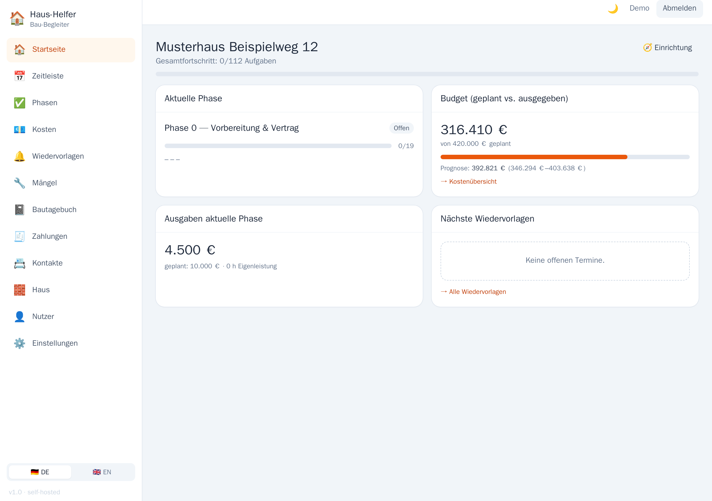
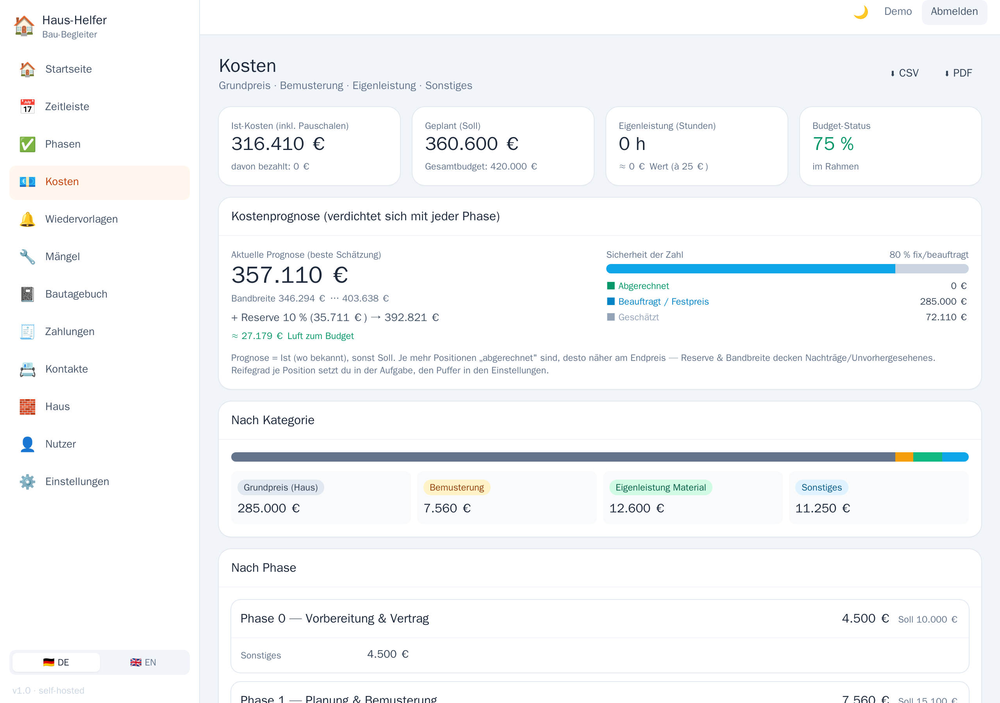
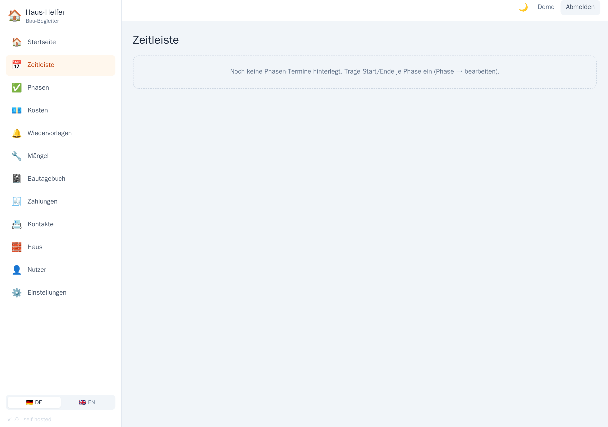
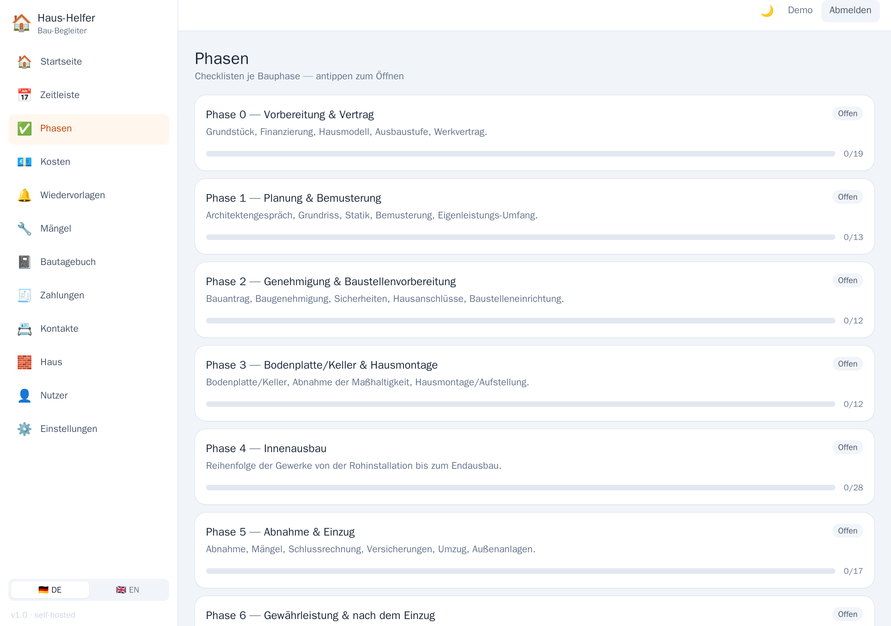
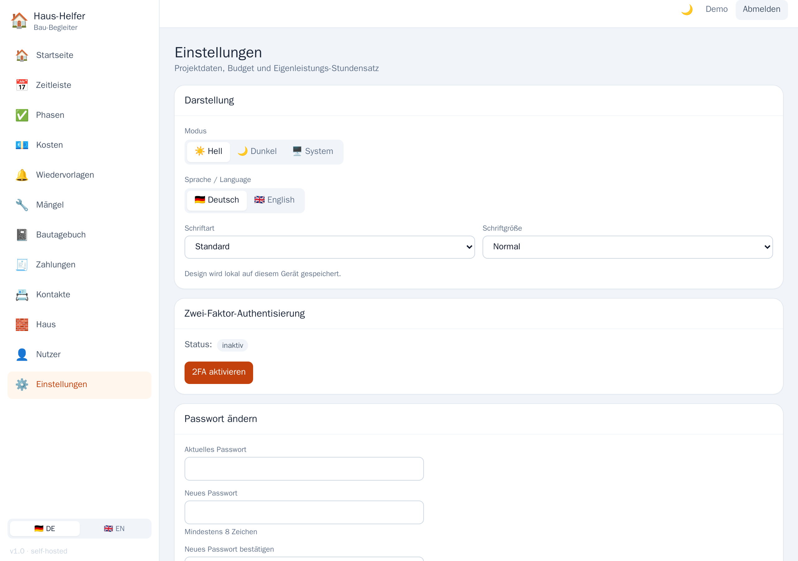

# 🏠 Fertighaus-Helfer

**English** · [Deutsch](README.md)

**Self-hosted build companion (PWA) for building a prefab / owner-finished house.**
Maps the building project **phase by phase** — from plot & contract to handover and warranty:
checklists, cost tracking with forecast, follow-ups with e-mail reminders, Gantt timeline,
defects list, construction diary, payment schedule and more. Runs entirely on your own server — **no cloud,
no external services**, all data stays with you.

> One household = one instance. The first user registers themselves as administrator on first launch;
> the admin invites further co-users (e.g. partner).

> **🇬🇧 English:** *Fertighaus-Helfer* is a self-hosted PWA companion for building a prefab / owner-finished
> house **in Germany**. The interface is **available in English** — switch via the sidebar (🇩🇪 DE / 🇬🇧 EN) or
> under **Settings**. An English checklist dataset can be seeded with `SEED_DATASET=generic-en`. Full English
> documentation: **[README.en.md](README.en.md)**. Note that the domain content references German building law
> (MaBV, § 650m BGB, KfW/BEG). One instance per household; the first visitor creates the admin account via onboarding.

---

## Features

- **Dashboard** — current phase, budget (planned vs. spent), upcoming follow-ups, guided setup assistant.
- **Phases & checklists** — checkable tasks per building phase, custom tasks, derived progress.
- **Costs & forecast** — planned/actual per phase and total, DIY hours → monetary value, cost forecast with
  range, maturity per item, buffer/reserve and cost-status history (snapshots).
- **Timeline** — Gantt with overlapping phases, milestone markers and a "today" line.
- **Follow-ups** — absolute dates **or** relative milestones (X days before), daily
  summary e-mail (via SMTP, configurable).
- **Defects list** — defects with photo, location, severity, deadline & status.
- **Construction diary** — dated entries (weather, trade, text) with photos; PDF export.
- **Payment schedule** — installments by construction progress (MaBV / § 650m BGB), planned/paid overview.
- **Contacts** — site manager, trades, authorities, utilities with direct phone/e-mail links.
- **File/photo attachments** — on tasks, defects and diary entries (local volume).
- **Exports** — costs as CSV/PDF, construction diary as PDF, appointments as ICS (calendar subscription).
- **House planning** — optional room-program module (feature flag).
- **PWA** — installable, app-shell caching (offline basic navigation), light/dark/system theme.
- **Bilingual** — interface switchable between **German/English** (sidebar & settings); optional English seed.
- **Security** — guided onboarding, JWT login (httpOnly cookie), optional **two-factor authentication
  (TOTP + recovery codes)**, rate limiting, security headers.
- **Single sign-on (OpenID Connect)** — optional login via an OIDC provider (e.g. Authentik); password login remains as a fallback.

---

## Screenshots

<p align="center"></p>

| Costs & forecast | Timeline (Gantt) |
|:---:|:---:|
| [](docs/screenshots/costs.png) | [](docs/screenshots/timeline.png) |
| **Phases & checklists** | **Settings — 2FA & language (DE/EN)** |
| [](docs/screenshots/phases.png) | [](docs/screenshots/settings.png) |

<sub>Screenshots use the demo dataset (`SEED_DATASET=demo`); UI shown in German, switchable to English.</sub>

---

## Quick start (prebuilt image)

Prerequisite: **Docker** + **Docker Compose v2**. No source checkout required.

```bash
# 1) Fetch compose file and env template
curl -O https://raw.githubusercontent.com/Bladeage/fertighaus-helper/master/docker-compose.public.yml
curl -o .env https://raw.githubusercontent.com/Bladeage/fertighaus-helper/master/.env.example

# 2) Fill in .env — set at least DB_PASSWORD and JWT_SECRET
nano .env
#    Generate JWT_SECRET:  openssl rand -base64 48

# 3) Start
docker compose -f docker-compose.public.yml up -d
```

Then open **http://<host>:8081** → the **onboarding page** guides you through creating your admin account.

The images live in the GitHub Container Registry (multi-arch amd64/arm64):

- `ghcr.io/bladeage/fertighaus-helper-backend`
- `ghcr.io/bladeage/fertighaus-helper-frontend`

Pin a version instead of `latest`: `TAG=1.2.0 docker compose -f docker-compose.public.yml up -d` (image tag without `v`).

### Try it with sample data

For a first impression (populated budget, costs, project data instead of empty) load the demo dataset:

```bash
SEED_DATASET=demo docker compose -f docker-compose.public.yml up -d
```

For real use, use `generic` (default). Screenshots are under [`docs/screenshots/`](docs/screenshots/).

---

## Configuration (`.env`)

| Variable | Purpose |
|---|---|
| `DB_PASSWORD` | Postgres password (choose freely) |
| `JWT_SECRET` | Signs the login tokens & key for 2FA secrets — **long random string** (`openssl rand -base64 48`) |
| `APP_URL` | Base URL for links in the e-mails (your domain or `http://<host>:8081`) |
| `WEB_PORT` | Host port of the WebUI (default `8081`) |
| `TAG` | Image tag (default `latest`) |
| `PROTON_SMTP_USER` / `PROTON_SMTP_PASSWORD` | SMTP access for reminder mails (default server ProtonMail; changeable via `PROTON_SMTP_SERVER`/`PROTON_SMTP_PORT`) |
| `MAIL_TO` | Recipients of the reminders (comma-separated) |
| `ENABLE_HOUSE_MODULE` | `true`/`false` — feature flag for the house module |
| `MAX_UPLOAD_MB` | max. size per file/photo attachment (default 15) |
| `SEED_DATASET` | Initial dataset (see [Datasets](#datasets)); `generic` (default), `demo` (sample data) or your own `custom` |
| `TRUST_PROXY` | Number of trusted reverse-proxy hops. **`1`** (default) for direct access on `:8081`; **`2`** if your own HTTPS reverse proxy sits in front. A wrong value renders the rate limits ineffective. |
| `OIDC_ENABLED` | `true`/`false` — enable **single sign-on** via OpenID Connect (details: [SSO](#single-sign-on-with-openid-authentik)). |
| `OIDC_ISSUER`, `OIDC_CLIENT_ID`, `OIDC_CLIENT_SECRET`, `OIDC_REDIRECT_URI` | Credentials of the OIDC provider (only when `OIDC_ENABLED=true`). |
| `OIDC_ALLOW_SIGNUP` | `true` (default) — auto-create unknown OIDC users (mapped by e-mail). |
| `OIDC_SHOW_PASSWORD_LOGIN` | `true` (default) — also show the password login when OIDC is on; `false` = OpenID only (password reachable via `?local=1`). |
| `OIDC_REQUIRE_VERIFIED_EMAIL` | `false` (default) — set `true` to link/create only for a provider-verified e-mail. |
| `OIDC_PROMPT` | Empty (default) = seamless SSO (correct behind a forward-auth gate); `login` = forces re-auth at the provider (operating without a gate). |

> **Users are not created via `.env`.** The first admin is created exclusively through the onboarding page.

---

## Security

- **Onboarding**: On first launch (0 users) the WebUI creates the first **admin**. After that, registration is
  closed; the admin creates further users under **Users**.
- **Login**: Passwords hashed with **bcrypt**; token in an **httpOnly cookie** (`Secure` over HTTPS, `SameSite=Lax`).
  API/CLI clients can alternatively use `Authorization: Bearer <token>`.
- **Two-factor authentication (2FA/TOTP)** — optional per user, enable in **Settings**
  (QR code for authenticator apps like Google Authenticator, Aegis or 1Password). Login then becomes two-step
  (password → 6-digit code). Additionally **10 one-time recovery codes** for device loss. TOTP secrets
  are stored **AES-256-GCM-encrypted** in the database.
- **Rate limiting** on login/setup/2FA, **security headers** (CSP, X-Frame-Options, …) at Nginx, **Helmet** at the backend,
  CORS same-origin by default.
- **Reverse proxy recommended**: The frontend serves the PWA on port 8081 and proxies `/api` → backend. Put a
  reverse proxy (Nginx Proxy Manager, Traefik, Caddy …) in front that **terminates HTTPS** and
  sets `X-Forwarded-Proto: https` (required for the Secure cookie).
- **Single sign-on (OpenID Connect)** — optional; see [Single Sign-On with OpenID](#single-sign-on-with-openid-authentik).
  The local password login remains as a fallback; the OIDC link is reversible (impersonation protection).

Admin tools (on the host):

```bash
# Reset password
docker compose exec backend node src/scripts/resetPassword.js <email> <new-password>

# Reset 2FA (if authenticator AND recovery codes were lost)
docker compose exec backend node src/scripts/disable2fa.js <email>

# Unlink a user's OIDC pairing (protection against impersonation)
docker compose exec backend node src/scripts/unlinkOidc.js <email>
```

---

## Single Sign-On with OpenID (Authentik)

Optionally, authentication can be delegated to an **OpenID Connect provider** (e.g.
[Authentik](https://goauthentik.io), Keycloak …). Users then sign in via **single sign-on**; the local
password login remains as a fallback.

**Enable** — in `.env`, then `docker compose up -d` (restart loads the variables):

```dotenv
OIDC_ENABLED=true
OIDC_ISSUER=https://auth.example.com/application/o/<slug>/
OIDC_CLIENT_ID=…
OIDC_CLIENT_SECRET=…
OIDC_REDIRECT_URI=https://<app-domain>/api/auth/oidc/callback
```

**Provider setup (Authentik example):** OAuth2/OpenID provider, client type **Confidential**, redirect URI
as above (Strict), **set a Signing Key** (RS256) and **leave the Encryption Key empty** (otherwise the ID
token is encrypted and login fails). Scopes `openid email profile`. Then create an application and assign the provider.

**Pairing:** On the first OpenID login the identity is linked to an existing account **by e-mail** — or, with
`OIDC_ALLOW_SIGNUP=true`, a new one is created. After that the fixed link applies.

**Options:**

| Variable | Effect |
|---|---|
| `OIDC_SHOW_PASSWORD_LOGIN=false` | Login page shows **only** the OpenID button. The password login stays reachable as break-glass via `…/?local=1`. |
| `OIDC_REQUIRE_VERIFIED_EMAIL=true` | New link/creation **only** for a provider-verified e-mail (protection against impersonation via foreign addresses). |

**Unlink the pairing (protection against impersonation):**

- **Self-service:** Settings → *OpenID link* → **Unlink**.
- **Admin (break-glass):** `docker compose exec backend node src/scripts/unlinkOidc.js <email>`

**Recommended — forward-auth gate in front:** For minimal attack surface, put an Authentik **forward-auth gate**
in the reverse proxy *in front of* the app; unauthenticated traffic never reaches the app, and the app's OpenID
login passes through seamlessly via SSO behind it. In that case leave `OIDC_PROMPT` empty (default); sign-in/out
and account switching happen at the gate (Authentik).

> Operating **without** a gate: set `OIDC_PROMPT=login` — Authentik then requires re-authentication on every
> login, so after logout you are not automatically logged back in and can switch accounts.

---

## Datasets

The seed populates the app on first launch with a **vendor-neutral** default roadmap for a prefab/
owner-finished house (phases, checklists, milestones, rooms, payment-schedule structure, contact roles). Amounts and dates
are deliberately empty and are filled in by you.

The dataset is interchangeable (`backend/src/prisma/data/`):

| File | Content | Included |
|---|---|---|
| `data/generic.js` | vendor-neutral default (German) | ✅ Default |
| `data/generic-en.js` | English translation of the default | ✅ (`SEED_DATASET=generic-en`) |
| `data/demo.js` | default + sample amounts/data | ✅ (`SEED_DATASET=demo`) |
| `data/custom.js` | your own/vendor-specific dataset | local (via `.gitignore`) |

Without `SEED_DATASET`, `custom` is preferred (if present), otherwise `generic`. `SEED_DATASET=generic|custom`
forces a dataset. You create your own dataset by copying `data/generic.js` to `data/custom.js`
and adjusting it.

> ⚠️ The seed matches tasks by title. Do **not** switch the dataset in an already-populated database —
> the tasks would be added in addition, not replaced.

---

## Build yourself / development

```bash
git clone https://github.com/Bladeage/fertighaus-helper.git
cd fertighaus-helper
cp .env.example .env && nano .env

# build & start from source
docker compose up -d --build
```

Locally without Docker:

```bash
# Backend
cd backend && npm install
npx prisma migrate deploy && npm run seed
npm run dev            # http://localhost:5000

# Frontend
cd frontend && npm install
npm run dev            # http://localhost:5173  (proxies /api -> :5000)
```

Building and publishing your own images is handled by the GitHub Actions workflow
(`.github/workflows/docker-publish.yml`): a push to `master` or a tag `v*` builds backend and frontend
(multi-arch) and pushes them to `ghcr.io`. The packages must be set to **public** once in the GitHub package settings
so they can be pulled without login.

---

## Useful commands

```bash
docker compose logs -f backend                       # Backend logs (incl. cron/seed)
docker compose exec backend node src/prisma/seed.js  # Seed again (idempotent)
docker compose down                                  # stop
docker compose down -v                               # stop + delete DB volume (data loss!)
```

### Backup

**Backups are built in and enabled out of the box** — there is nothing to set up.
The backend backs up the **database** and the **attachments** daily at 03:30 by default
and keeps the last 14 backups.

Configurable under **Settings → Backup** (admins only):

| Setting | Default | Meaning |
|---|---|---|
| Automatic backup | on | Scheduled backup enabled |
| Frequency | daily | daily or weekly |
| Time | 03:30 | Timezone `Europe/Berlin` |
| Keep (count) | 14 | older ones are deleted; `0` = unlimited |

The same page holds the **Back up now** button and a **download link** per backup
(database and files separately).

> **Important:** Backups live in the `backups_data` volume — on the **same disk** as your
> data. That protects against accidental deletion, not against disk failure. Download them
> regularly, or mount `/app/backups` as a bind mount and mirror the folder elsewhere.

Initial values for a fresh installation can be set via env vars (`BACKUP_ENABLED`,
`BACKUP_FREQUENCY`, `BACKUP_TIME`, `BACKUP_WEEKDAY`, `BACKUP_KEEP`). After the first
start the UI settings take over — with one exception: `BACKUP_ENABLED=false` disables
backups entirely, regardless of the UI.

Alternatively (or additionally) the host script, which produces the same filenames:

```bash
./scripts/backup.sh
# Public compose:  COMPOSE="docker compose -f docker-compose.public.yml" ./scripts/backup.sh
```

**Take a backup before every update** — the backend startup migrates the database automatically.

#### Restore

Fetch the backups from the volume (or download them in the UI):

```bash
docker compose cp backend:/app/backups ./backups
```

Restore — **overwrites existing data**:

```bash
gunzip -c backups/db-<stamp>.sql.gz | docker compose exec -T db psql -U alkauf_user -d alkauf_haus
docker compose exec -T backend tar xzf - -C /app < backups/uploads-<stamp>.tar.gz
docker compose restart backend
```

The dump is created with `--no-owner --no-privileges`, so it can also be restored into an
instance that uses a different database user.

---

## Technology

`backend/` Node 20 · Express · Prisma · PostgreSQL — JWT auth, 2FA (TOTP), CRUD, costs, cron mail.
`frontend/` React 18 · Vite · TypeScript · Tailwind — installable PWA.
The backend runs as non-root in the container; migration & idempotent seed run automatically on startup.

---

## License

Released under the **MIT license** — see [LICENSE](LICENSE). Use, modification and distribution (including
commercial) are free as long as the copyright notice is retained. The software comes without warranty.

## Notes

The vendor-neutral dataset reflects the generally customary prefab-house process; references to laws and standards
(KfW/BEG, MaBV, § 650m BGB, DIN/VDE, MaStR, § 14a EnWG) are generally applicable. The project has **no
affiliation** with any particular house provider; any brand names mentioned (if used in your own `custom` dataset)
belong to their respective owners. No warranty — check the requirements applicable to your building project
yourself or with professionals.
